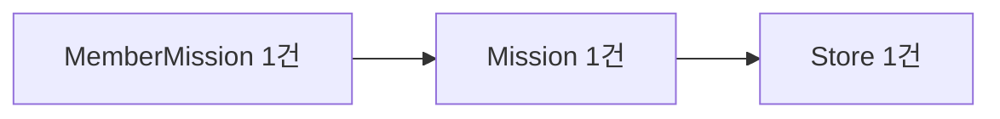
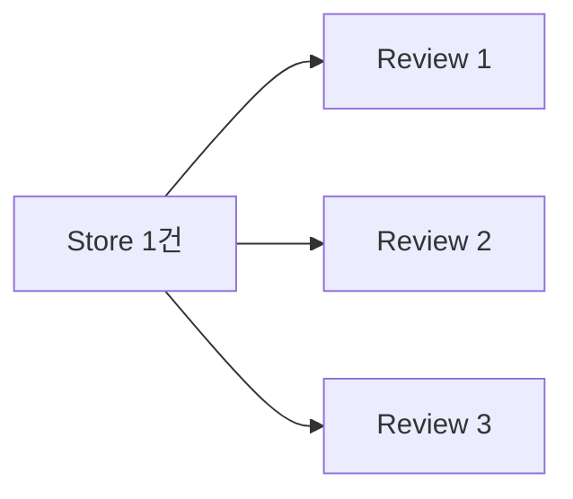

# 7주차 피드백 정리 md

## 1. 피드백 내용

7주차 피드백에서 `join fetch`와 `Pageable`을 함께 사용할 때 `HHH000104` 또는 Hibernate 6 계열의 유사 warning이 발생할 수 있다는 내용을 받았다.

사실 처음 보는 warning 코드라 ai와 구글링으로 찾아보니, 이 warning은 Hibernate가 `Collection fetch join + pagination`이 있는 쿼리를 실행할 때 발생하는 경고였다.

> 정리하면 처음에는 "fetch join과 pagination을 같이 쓰면 항상 위험한가?"라고 생각했지만, 다시 확인해보니 핵심은 **to-one fetch join인지 collection fetch join인지 구분하는 것**이였다!?

그래서 조금 더 알아보고 정리해보았다.

## 2. Fetch Join이 필요한 이유

JPA 연관관계는 보통 `LAZY`로 둔다. 그래서 처음에는 root entity만 조회하고, 연관 객체는 실제로 접근할 때 추가 쿼리로 가져온다.

예를 들어 `MemberMission` 목록을 조회한 뒤 DTO 변환에서 다음처럼 연관 객체를 탐색한다.

```java
memberMission.getMission().getStore().getName()
```

연관 객체를 미리 가져오지 않았다면 다음 흐름이 될 수 있다.

```text
1. MemberMission 목록 조회
2. 각 MemberMission의 Mission 접근 시 추가 조회
3. 각 Mission의 Store 접근 시 추가 조회
```

이런 반복 추가 조회가 흔히 말하는 N+1 문제다.

`fetch join`은 JPQL에서 연관 객체를 함께 로딩하라고 Hibernate에게 알려주는 문법이다.

```java
select mm
from MemberMission mm
join fetch mm.mission m
join fetch m.store s
```

이 쿼리는 `MemberMission`을 조회하면서 `Mission`, `Store`까지 한 번에 영속성 컨텍스트에 채운다. 그래서 DTO 변환 시 `mission`, `store`를 접근해도 추가 select가 줄어든다.

## 3. To-One Fetch Join과 Collection Fetch Join

fetch join 자체가 항상 문제는 아니다. 중요한 차이는 **root entity 한 건이 SQL join 결과에서 몇 row로 표현되는가**다.

### 3.1 To-One Fetch Join

to-one fetch join은 `ManyToOne`, `OneToOne`처럼 root entity 한 건이 연관 객체 한 건과 연결되는 방향이다.



이 경우 SQL join을 해도 root entity인 `MemberMission` 한 건이 보통 결과 row 한 건에 대응된다.

```text
MemberMission 1 -> Mission 1 -> Store 1
결과 row 수: MemberMission 개수와 거의 같음
```

### 3.2 Collection Fetch Join

collection fetch join은 `OneToMany`, `ManyToMany`처럼 root entity 한 건이 여러 자식 row와 연결되는 방향이다.



이 경우 SQL join 결과에서는 `Store` 한 건이 리뷰 수만큼 반복된다.

```text
Store 1 -> Review 3개
SQL join 결과 row 수: 3 row
Java entity 관점 root Store 수: 1개
```

즉 DB가 보는 row 수와 JPA가 조립하려는 root entity 수가 달라진다.

## 4. Collection Fetch Join + Pagination이 위험한 이유

pagination은 DB row 기준으로 `limit`, `offset`을 적용한다.

```sql
select ...
from store s
join review r on r.store_id = s.store_id
limit 10 offset 0;
```

그런데 collection join으로 root row가 부풀면, DB의 `limit 10`은 "가게 10개"가 아니라 "join 결과 row 10개"에 적용된다.

예를 들어 가게마다 리뷰가 5개씩 있다고 하면 SQL row는 다음처럼 만들어질 수 있다.

```text
Store A + Review 1
Store A + Review 2
Store A + Review 3
Store A + Review 4
Store A + Review 5
Store B + Review 1
Store B + Review 2
...
```

DB에서 `limit 10`을 걸면 가게 10개가 아니라 `Store A`, `Store B`의 일부 row만 잘릴 수 있다. 하지만 JPA는 최종적으로 중복 row를 합쳐 `Store` entity 목록을 만들어야 한다.

그래서 Hibernate는 collection fetch join이 있는 pagination에서 DB limit/offset을 그대로 밀어붙이면 root entity 페이지가 깨질 수 있다고 판단한다. 이때 Hibernate가 선택할 수 있는 방식은 다음과 같다.

```text
1. SQL에서 limit/offset을 빼고 더 많은 join row를 가져온다.
2. 메모리에서 Store 중복을 합친다.
3. Java 메모리에서 원하는 page만 잘라낸다.
```

이것이 리뷰에서 말한 "DB에서 페이징하지 않고 메모리에서 페이징한다"는 의미다.

데이터가 많아지면 다음 문제가 생길 수 있다.

```text
DB에서 필요한 10개만 가져오는 것이 아니라,
조건에 맞는 많은 row를 애플리케이션으로 가져올 수 있음
-> 네트워크 사용량 증가
-> 애플리케이션 메모리 사용량 증가
-> 최악의 경우 OOM 가능성
```

## 5. 한 줄 정리와 얻어갈 점

**한 줄 정리:** `Collection fetch join + pagination`은 root entity 한 건이 여러 join row로 부풀어 DB의 `limit/offset` 기준과 JPA의 entity page 기준이 어긋날 수 있고, 그 결과 Hibernate가 많은 row를 가져와 메모리에서 페이징하면서 성능 문제가 생길 수 있다.

이번 피드백에서 얻어갈 점은 다음과 같다.

- `fetch join + pagination`이 항상 나쁜 것은 아니고, **to-one fetch join인지 collection fetch join인지**를 먼저 구분해야 한다.
- 성능 문제의 핵심은 `fetch join`이라는 문법 자체가 아니라, `OneToMany`, `ManyToMany` 조회에서 root entity가 join 결과 row 수만큼 반복되는 구조다.
- DTO 변환에서 N+1을 막기 위해 연관 객체를 미리 가져오는 것은 필요하지만, 컬렉션까지 한 번에 fetch join하면서 page를 자르는 방식은 조심해야 한다.
- 페이징 API에서는 먼저 root id를 안정적으로 page 조회하고, 그 id 목록으로 필요한 연관 데이터를 다시 가져오는 2-step query가 안전한 선택지가 될 수 있다.
- `hibernate.query.fail_on_pagination_over_collection_fetch=true` 같은 guard를 dev/test 환경에 켜두면 위험한 쿼리가 조용히 메모리 페이징으로 넘어가는 것을 빨리 발견할 수 있다.

그래서 보통 다음 원칙을 둔다고 한다.

```text
To-one fetch join + pagination
-> 대체로 허용 가능

Collection fetch join + pagination
-> 피한다
-> 2-step query, @BatchSize, default_batch_fetch_size 등을 고려한다
```

## 6. 이번 미션 코드에 적용한 방식

기존 쿼리는 `MemberMission -> Mission -> Store`의 to-one fetch join이었다. 따라서 파트장님이 말한 collection fetch join + pagination 문제와 정확히 같은 케이스는 아니었다.

다만 피드백을 계기로 더 보수적인 구조를 적용했다.

```text
1단계: MemberMission ID만 Page<Long>으로 조회
2단계: 조회된 ID 목록으로 MemberMission -> Mission -> Store fetch join
3단계: 1단계에서 얻은 ID 순서대로 다시 정렬한 뒤 DTO 변환
```

변경 후 Repository 구조는 다음과 같다.

```text
findIdsByMemberAndStatusesWithOffset(...)
-> fetch join 없이 ID만 page 조회

findAllWithMissionAndStoreByIdIn(...)
-> Pageable 없이 필요한 to-one 연관 객체만 fetch join
```

이렇게 하면 `Pageable`이 걸린 쿼리에는 fetch join이 없고, fetch join이 들어간 쿼리에는 pagination이 없다. 지금은 to-one fetch join이라 필수 개선은 아니지만, 나중에 collection fetch join이 섞이는 상황으로 확장되어도 설명하기 좋은 패턴이다.

또한 `application.yml`에 다음 guard를 켰다.

```yaml
spring:
  jpa:
    properties:
      hibernate:
        query:
          fail_on_pagination_over_collection_fetch: true
```

이 설정은 앞으로 누군가 컬렉션 fetch join과 pagination을 함께 쓰는 쿼리를 추가했을 때, Hibernate가 조용히 메모리 페이징으로 처리하지 않고 실패하도록 만들어준다.

## 7. 직접 검증한 내용

DB를 켠 상태에서 Spring Boot 애플리케이션을 `localhost:8080`으로 실행하고 직접 curl을 통해 API를 호출했다.


검증 요청:

```http
POST /api/member-missions/in-progress?pageNumber=0&pageSize=1
Content-Type: application/json

{"memberId":1}
```

응답 요약:

```text
HTTP 200
missions: 1개
pageNumber: 0
pageSize: 1
totalElements: 2
totalPages: 2
isFirst: true
isLast: false
```

검증 실패 요청:

```http
POST /api/member-missions/in-progress?pageNumber=0&pageSize=0
Content-Type: application/json

{"memberId":1}
```

응답 요약:

```text
HTTP 400
result.pageSize = "페이지 크기는 1 이상이어야 합니다."
```

Hibernate 로그에서 확인한 쿼리 흐름:

```text
1. ID page query
   - member_mission_id만 조회
   - order by member_mission_id desc
   - limit 적용

2. count query
   - totalElements 계산

3. detail fetch query
   - member_mission -> mission -> store join
   - where member_mission_id in (...)
   - Pageable/limit 없음
```

판정:

```text
PASS: Pageable이 걸린 쿼리에는 fetch join이 없다.
PASS: fetch join이 들어간 상세 조회 쿼리에는 Pageable/limit이 없다.
@@@ PASS: API 호출 로그에서 HHH000104 / HHH90003004 warning은 확인되지 않았다.@@@
PASS: pageSize=0 검증 실패가 ApiResponse 형식의 HTTP 400으로 내려온다.
```
